# Car Renting Platform 🚗

A full-stack car rental platform with role-based access control for Admins, Drivers, and Users. Built with React, TypeScript, Redux Toolkit, and Node.js.

## 🔗 Links

- **Frontend Repository**: [https://github.com/mohamim360/car-renting-frontend](https://github.com/mohamim360/car-renting-frontend)
- **Backend Repository**: [https://github.com/mohamim360/Car-Renting-backend](https://github.com/mohamim360/Car-Renting-backend)
- **Live Frontend**: [https://car-renting-frontend.vercel.app/](https://car-renting-frontend.vercel.app/)
- **API Backend**: [https://car-renting-backend-3.onrender.com/](https://car-renting-backend-3.onrender.com/)

---

## 📋 Table of Contents

- [Features](#features)
- [Tech Stack](#tech-stack)
- [Screenshots](#screenshots)
- [Installation](#installation)
- [Environment Variables](#environment-variables)
- [Project Structure](#project-structure)
- [User Roles](#user-roles)
- [API Endpoints](#api-endpoints)
---

## ✨ Features

### General Features
- 🔐 JWT-based authentication with role-based access control
- 📱 Fully responsive design for mobile, tablet, and desktop
- 🎨 Modern UI with Tailwind CSS and shadcn/ui components
- 🔄 Real-time data updates with Redux Toolkit
- 🚀 Fast loading and optimized performance

### User Features
- Browse available cars with detailed specifications
- Rent cars by specifying starting point and destination
- View rental history with status tracking (pending, ongoing, completed)
- Receive and manage driver bids for rental requests
- Accept or reject driver bids
- Update rental destinations and status

### Driver Features
- View available rental jobs
- Place bids on rental requests with custom pricing
- Track bid status (pending, accepted, rejected)
- View active jobs and earnings
- Manage bid submissions

### Admin Features
- Complete dashboard with system overview
- Manage car inventory (add, edit, delete cars)
- User management (create, update, delete users, assign roles)
- Monitor all rentals across the platform
- View and manage all bids
- Track revenue and system statistics

---

## 🛠 Tech Stack

### Frontend
- **React 19** - UI library
- **TypeScript** - Type safety
- **Redux Toolkit** - State management
- **React Router v7** - Routing
- **Tailwind CSS v4** - Styling
- **shadcn/ui** - UI components
- **Lucide React** - Icons
- **React Hook Form** - Form handling
- **Axios** - HTTP client
- **Vite** - Build tool

### Backend
- **Node.js** - Runtime environment
- **Express.js** - Web framework
- **MongoDB** - Database
- **Mongoose** - ODM
- **JWT** - Authentication
- **Bcrypt** - Password hashing

---

## 📸 Screenshots

### Home Page
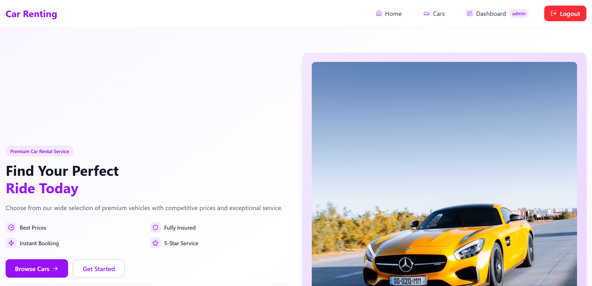
*Landing page with featured cars and top brands*

### Car Listing
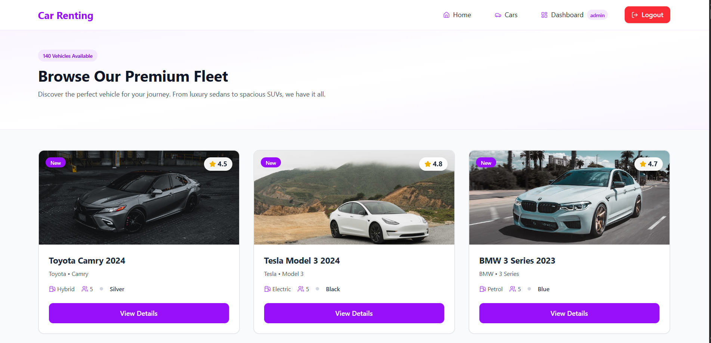
*Browse all available cars with filters*

### Car Details
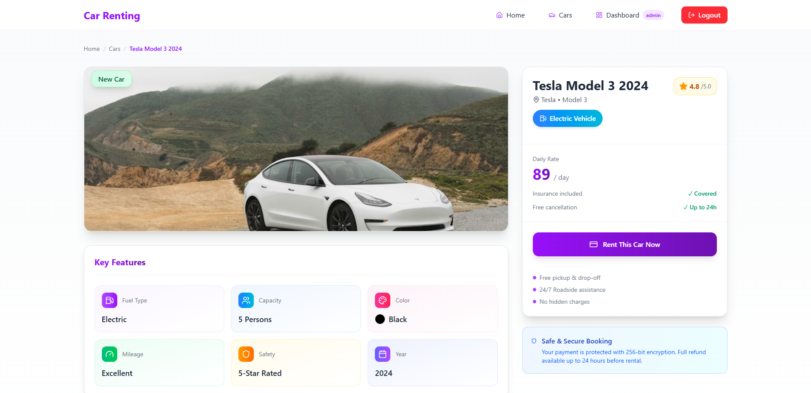
*Detailed view of a specific car*

### User Registration
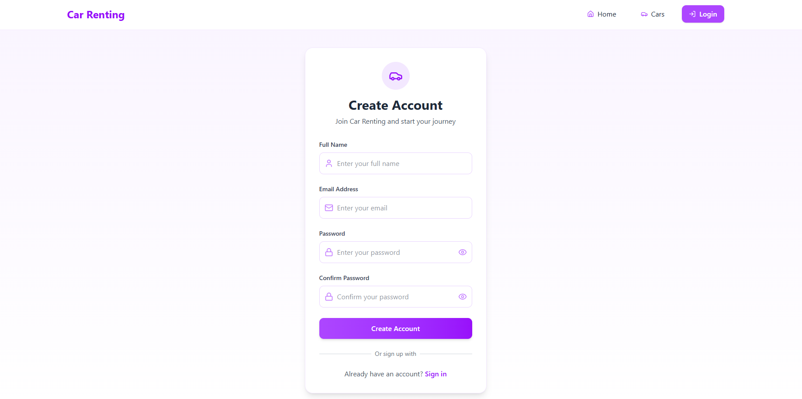
*User registration form*

### User Login
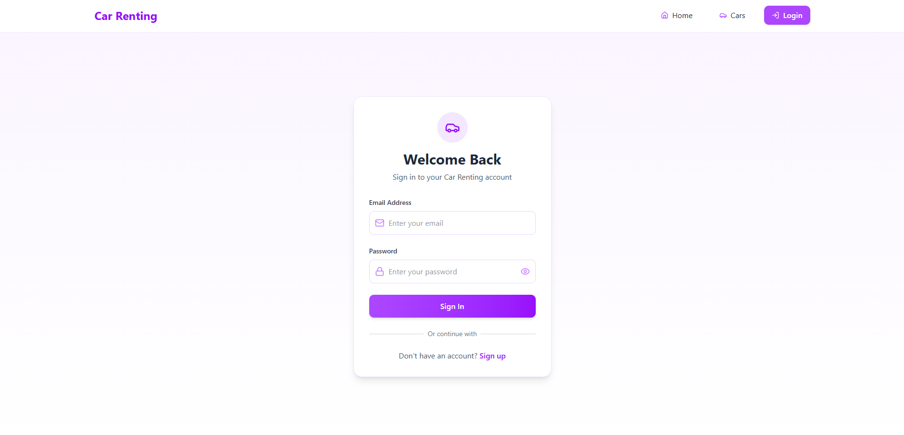
*Login page*


### Rent Car
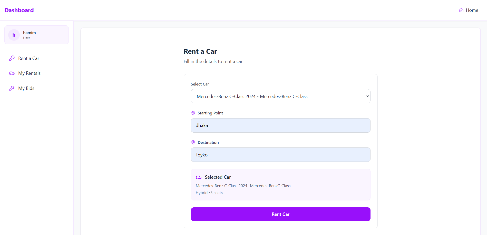
*Form to rent a car*

### My Bids (User)
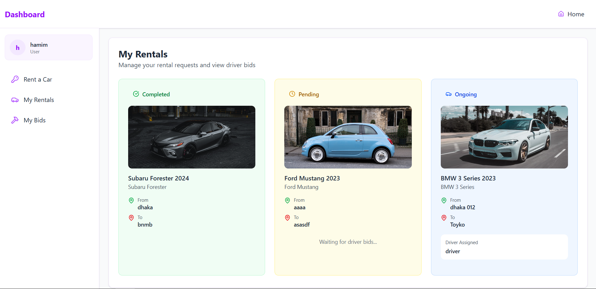
*View and manage driver bids*


### Admin Dashboard
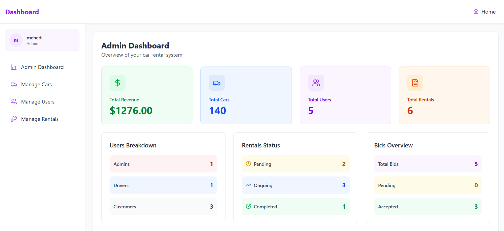
*Admin dashboard with statistics*

### Cars Management
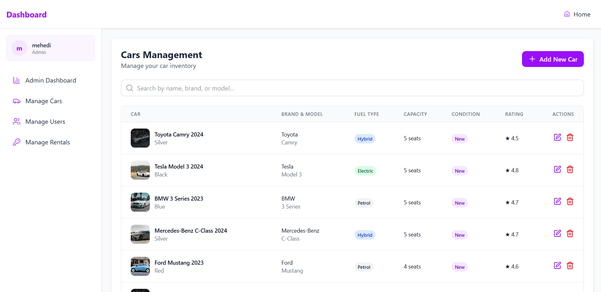
*Admin car inventory management*

### Users Management
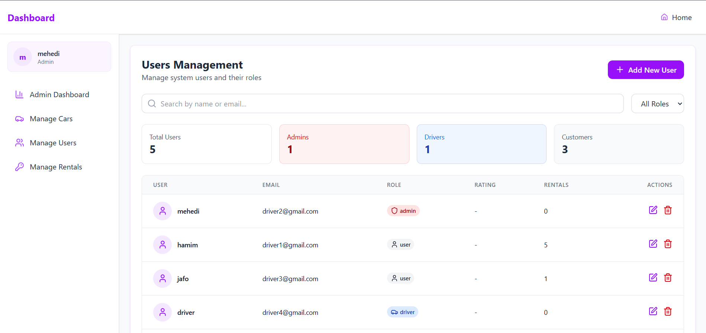
*Admin user management panel*

### Rentals Management
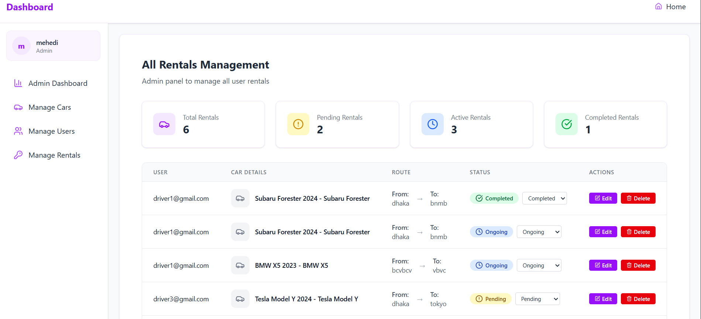
*Admin view of all rentals*

### Driver Dashboard
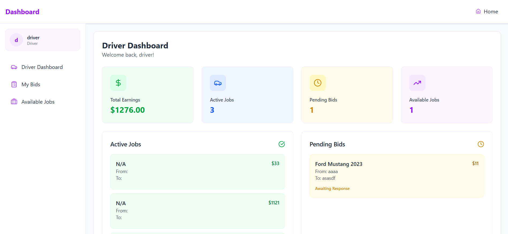
*Driver dashboard with earnings*

### Available Jobs
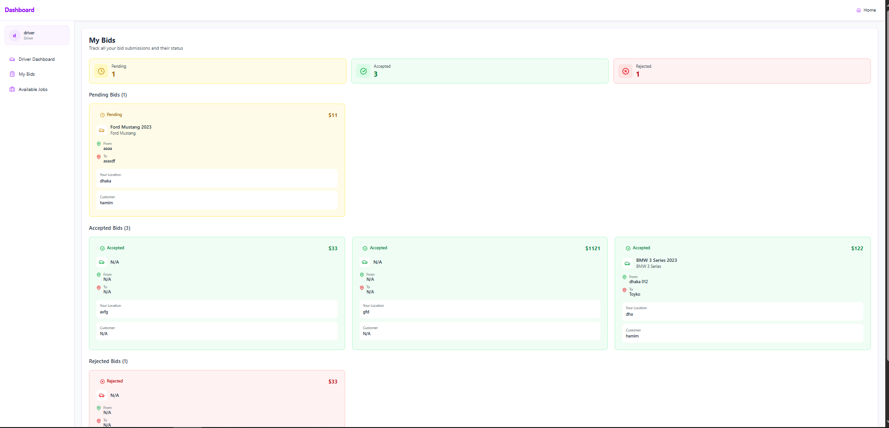
*Driver view of available rental requests*

### My Bids (Driver)
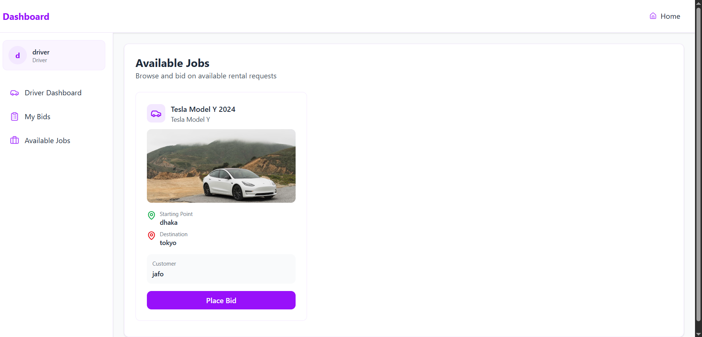
*Driver's bid submissions*

---

## 🚀 Installation

### Prerequisites
- Node.js (v18 or higher)
- MongoDB (local or Atlas)
- npm or yarn

### Frontend Setup

```bash
# Clone the repository
git clone https://github.com/mohamim360/car-renting-frontend.git
cd car-renting-frontend

# Install dependencies
npm install

# Create .env file
cp .env.example .env

# Start development server
npm run dev
```

### Backend Setup

```bash
# Clone the repository
git clone https://github.com/mohamim360/Car-Renting-backend.git
cd Car-Renting-backend

# Install dependencies
npm install

# Create .env file
cp .env.example .env

# Start development server
npm run dev
```

---

## 🔑 Environment Variables

### Frontend (.env)
```env
VITE_API_BASE_URL=http://localhost:5000/api
```

### Backend (.env)
```env
PORT=5000
MONGODB_URI=mongodb://localhost:27017/car-renting
JWT_SECRET=your_jwt_secret_key
JWT_EXPIRES_IN=7d
NODE_ENV=development
```

---

## 📁 Project Structure

```
car-renting-frontend/
├── public/
├── src/
│   ├── assets/              # Images and static files
│   ├── components/
│   │   ├── routes/          # Route protection components
│   │   └── ui/              # Reusable UI components
│   ├── layouts/
│   │   ├── CommonLayout.tsx # Public pages layout
│   │   └── DashboardLayout.tsx # Dashboard layout
│   ├── lib/
│   │   ├── api.ts           # Axios configuration
│   │   └── utils.ts         # Utility functions
│   ├── pages/
│   │   ├── dashboard/       # Dashboard pages
│   │   ├── Home.tsx
│   │   ├── Cars.tsx
│   │   ├── CarDetails.tsx
│   │   ├── Login.tsx
│   │   └── Register.tsx
│   ├── store/
│   │   ├── slices/          # Redux slices
│   │   ├── hooks.ts
│   │   └── store.ts
│   ├── App.tsx
│   ├── main.tsx
│   └── index.css
├── .env
├── package.json
├── tailwind.config.js
└── vite.config.ts
```

---

## 👥 User Roles

### Admin
- Full system access
- Manage cars, users, and rentals
- View analytics and statistics
- Monitor all platform activities

### Driver
- View available rental jobs
- Place bids on rentals
- Track earnings
- Manage active jobs

### User (Customer)
- Browse and rent cars
- View rental history
- Manage bids from drivers
- Update rental information

---

## 🔌 API Endpoints

### Authentication
```
POST   /api/auth/register    # Register new user
POST   /api/auth/login       # Login user
```

### Users
```
GET    /api/users            # Get all users (Admin)
GET    /api/users/:id        # Get user by ID
POST   /api/users            # Create user (Admin)
PATCH  /api/users/:id        # Update user
DELETE /api/users/:id        # Delete user (Admin)
```

### Cars
```
GET    /api/cars             # Get all cars
GET    /api/cars/:id         # Get car by ID
POST   /api/cars             # Create car (Admin)
PATCH  /api/cars/:id         # Update car (Admin)
DELETE /api/cars/:id         # Delete car (Admin)
```

### Rentals
```
GET    /api/rents            # Get all rentals
GET    /api/rents/:id        # Get rental by ID
GET    /api/rents/user/:id   # Get user's rentals
POST   /api/rents            # Create rental
PATCH  /api/rents/:id        # Update rental
DELETE /api/rents/:id        # Delete rental
```

### Bids
```
GET    /api/bids             # Get all bids
GET    /api/bids/:id         # Get bid by ID
POST   /api/bids             # Create bid (Driver)
PATCH  /api/bids/:id         # Update bid
DELETE /api/bids/:id         # Delete bid
```

